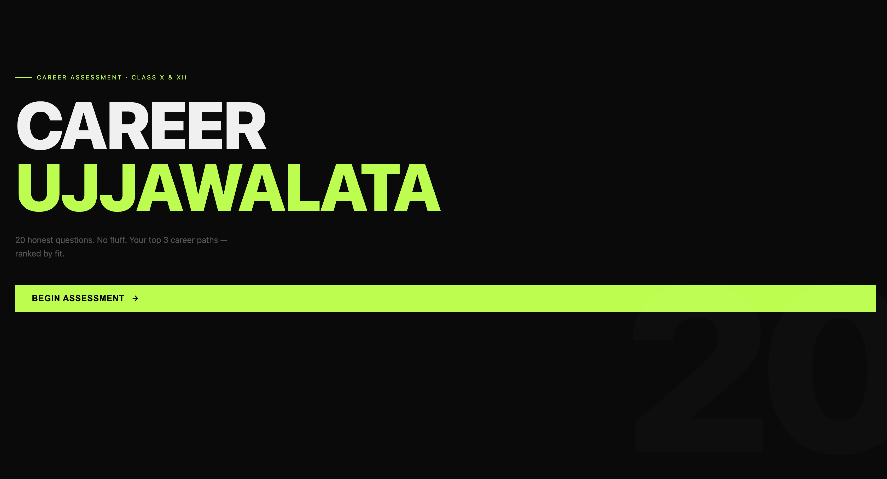
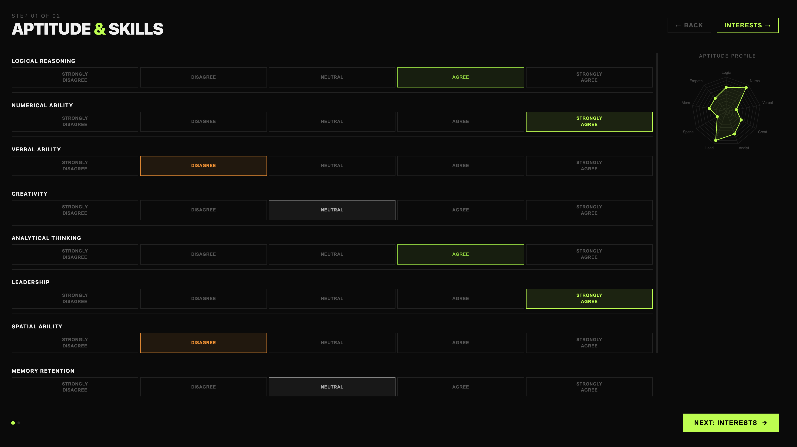
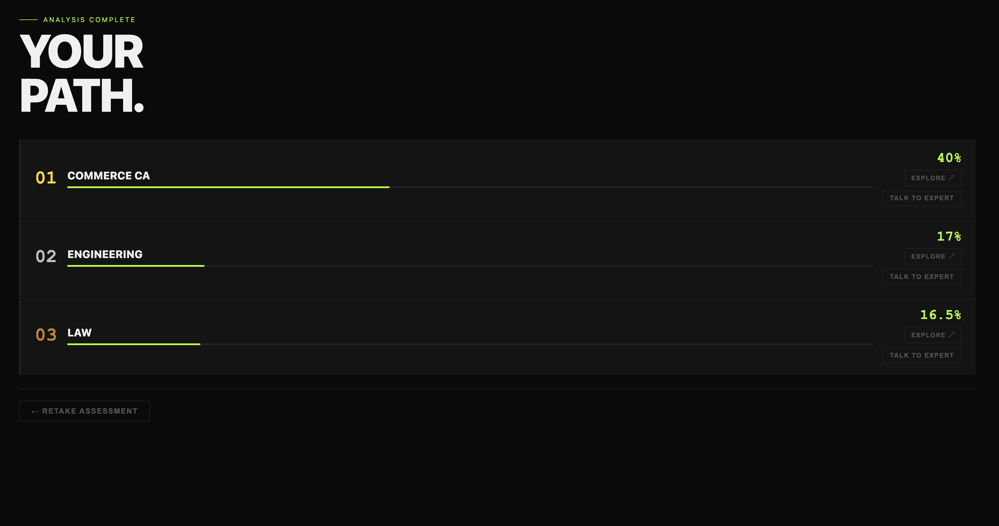
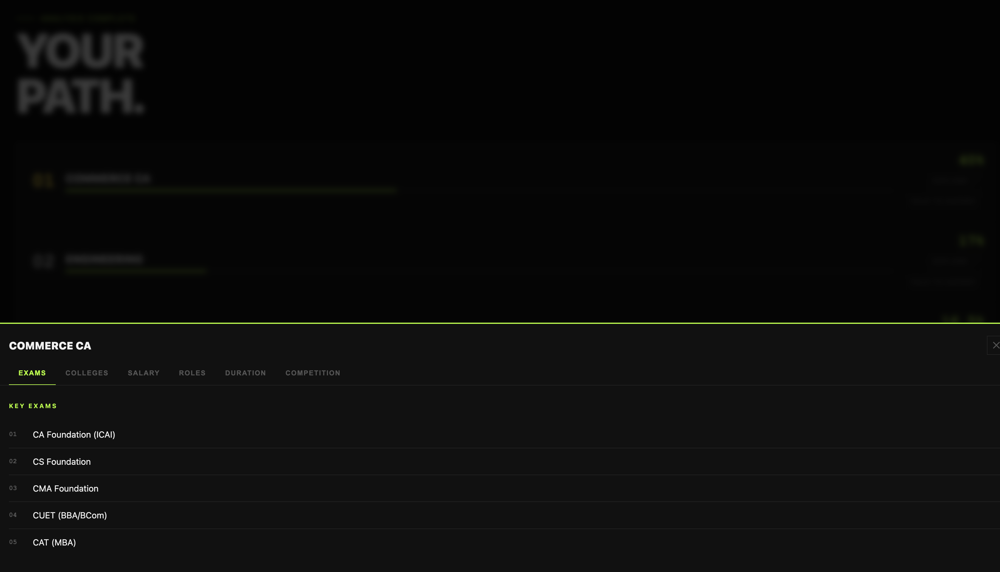

# Career Ujjawalata

> AI-powered career guidance for Indian students (Class 10 & 12)

[](https://python.org)
[](https://fastapi.tiangolo.com)
[](https://scikit-learn.org)
[](#model)

A full-stack web application that recommends top 3 career paths based on a student's aptitude profile and subject interests — built with a Random Forest classifier, FastAPI backend, and an interactive single-page frontend.

---

## Screenshots

| Hero Screen | Assessment |
| ----------- | ---------- |
|  |  |

| Results | Career Details |
| ------- | -------------- |
|  |  |

---

## Features

- **20-parameter assessment** — 9 aptitude traits + 11 subject interest scores
- **Likert scale UI** — 5-option response scale (Strongly Disagree → Strongly Agree)
- **Live radar charts** — aptitude and interest profiles update in real time as you answer
- **Top 3 career recommendations** with confidence scores
- **Career detail drawer** — exams, top colleges, salary ROI, roles, study duration, competition level
- **Expert connect modal** — contact a domain expert for each career path
- **Confetti reveal** on results screen

---

## Career Paths

| Career | Key Signals |
| ------ | ----------- |
| Engineering | High logic, maths, physics, computers |
| Medicine | High biology, chemistry, memory, empathy |
| Commerce / CA | High economics, business, numerical ability |
| Arts & Humanities | High verbal, creativity, literature, arts |
| Law | High verbal, logical reasoning, memory, history |
| Design & Architecture | High creativity, spatial ability, arts |

---

## Tech Stack

| Layer | Technology |
| ----- | ---------- |
| ML Model | scikit-learn `RandomForestClassifier` (200 trees, depth 12) |
| Data | Synthetic — Likert-sampled from archetype distributions |
| Backend | FastAPI + Pydantic v2 |
| Server | Uvicorn (ASGI) |
| Frontend | Vanilla JS, Chart.js (radar), canvas-confetti |
| Styling | CSS custom properties, dark theme |

---

## Project Structure

```
career_guidance/
├── generate_data.py     # Synthetic dataset generator (Likert-sampled archetypes)
├── train_model.py       # Trains and saves Random Forest model
├── predict.py           # predict_top3() — importable inference function
├── app.py               # FastAPI app — serves UI + /predict endpoint
├── static/
│   └── index.html       # Full single-page wizard frontend
├── requirements.txt
└── README.md
```

---

## Assessment Parameters

### Aptitude (9 traits)

| Parameter | Description |
| --------- | ----------- |
| `logical_reasoning` | Deductive and inductive logic |
| `numerical_ability` | Arithmetic and quantitative aptitude |
| `verbal_ability` | Language comprehension and expression |
| `creativity` | Original thinking and ideation |
| `analytical_thinking` | Problem decomposition and analysis |
| `leadership` | Initiative, teamwork, and decision-making |
| `spatial_ability` | Visualising 2D/3D structures and relationships |
| `memory_retention` | Recall of facts, sequences, and concepts |
| `empathy` | Understanding and responding to others' needs |

### Subject Interests (11 subjects)

`Physics` · `Chemistry` · `Biology` · `Mathematics` · `Literature` · `Economics` · `Arts` · `Computers` · `History` · `Psychology` · `Business`

All parameters scored 0–100 (frontend maps Likert responses to 10 / 30 / 50 / 70 / 90).

## API Reference

### `POST /predict`

Accepts 20 numeric scores (0–100), returns top 3 career recommendations.

#### Request body

```json
{
  "logical_reasoning": 90,
  "numerical_ability": 88,
  "verbal_ability": 52,
  "creativity": 58,
  "analytical_thinking": 87,
  "leadership": 62,
  "spatial_ability": 84,
  "memory_retention": 70,
  "empathy": 48,
  "interest_physics": 91,
  "interest_chemistry": 74,
  "interest_biology": 38,
  "interest_maths": 93,
  "interest_literature": 35,
  "interest_economics": 50,
  "interest_arts": 30,
  "interest_computers": 91,
  "interest_history": 33,
  "interest_psychology": 38,
  "interest_business": 52
}
```

#### Response

```json
{
  "recommendations": [
    { "career": "Engineering",    "confidence": 94.5 },
    { "career": "Design Architecture", "confidence": 3.2 },
    { "career": "Commerce CA",    "confidence": 1.4 }
  ]
}
```

---

## Model

- **Algorithm:** `RandomForestClassifier` — 200 estimators, max depth 12
- **Training data:** 1200 samples (200 per class), Likert-sampled from archetype (mean, std) distributions
- **Features:** 20 (9 aptitude + 11 interest)
- **Classes:** 6 career paths
- **Train/test split:** 80/20, stratified
- **Accuracy:** 99.58%

---

